<div align="center">
  
  
  <h1>Hi there, I'm Žygimantas </h1>
  
  <!-- Animated Typing -->
  <a href="https://git.io/typing-svg">
    
  </a>
  
  <br><br>
  
  <!-- Profile Views & Social Badges -->
  
  <a href="https://www.linkedin.com/in/%C5%BEygimantas-b-909939228/">
    
  </a>
  <a href="https://wakatime.com/@7d99a804-4ea4-48e9-8ab2-a1f8c025baeb">
    
  </a>
</div>

---

## 🎯 About Me


I am passionate about uncovering insights and solving complex problems, transitioning into the field of data analysis. With a strong foundation in Python programming and a deep interest in data-driven decision-making, I have been self-teaching techniques in data cleaning, manipulation, and visualization.

- 🔭 Currently working on **[Data Science & ML Projects](https://github.com/ZygimantasB/data_science_ml_learning)**
- 🌱 Learning **Advanced Machine Learning & Deep Learning**
- 👯 Looking to collaborate on **Open-source Data Science Projects**
- 💬 Ask me about **Python, Data Analysis, SQL, and Backend Development**
- 📫 Reach me at **[LinkedIn](https://www.linkedin.com/in/%C5%BEygimantas-b-909939228/)**
- ⚡ Fun fact: **I enjoy exploring new data science tools and frameworks!**

<br clear="both">

---

## 📈 Skill Proficiency

<div align="center">

### Data Analysis & Visualization


### Machine Learning


### Backend Development


### Data Visualization Tools


</div>

---

## 📚 Currently Learning

<div align="center">

| Technology | Progress | Target |
|------------|----------|--------|
| 🤖 **Deep Learning / Neural Networks** |  | Advanced |
| 📊 **Apache Airflow** |  | Intermediate |
| ☁️ **AWS / Cloud Computing** |  | Intermediate |
| 🔄 **MLOps** |  | Beginner |
| 📈 **Time Series Analysis** |  | Advanced |

</div>

---

## 🏅 Certifications & Achievements

<div align="center">

| Certification | Issuer | Year | Status |
|--------------|--------|------|--------|
| 🐍 **Python for Data Science** | Self-taught | 2024 | ✅ Completed |
| 📊 **Data Analysis with Pandas** | Self-taught | 2024 | ✅ Completed |
| 🗄️ **SQL Fundamentals** | Self-taught | 2024 | ✅ Completed |
| 🌐 **Django Web Development** | Self-taught | 2024 | ✅ Completed |
| 🤖 **Machine Learning Basics** | Self-taught | 2024 | 🔄 In Progress |
| ☁️ **Cloud Computing Fundamentals** | - | 2025 | 📋 Planned |

</div>

---

## 📊 GitHub Statistics

<div align="center">
  
  
</div>

<div align="center">
  
</div>

---

## 🕐 Weekly Coding Stats

<div align="center">

<!--START_SECTION:waka-->
```text
📊 This Week I Spent My Time On:

Python       ██████████████████░░░   85%
SQL          ███░░░░░░░░░░░░░░░░░░   10%
Markdown     █░░░░░░░░░░░░░░░░░░░░   3%
Other        ░░░░░░░░░░░░░░░░░░░░░   2%
```
<!--END_SECTION:waka-->

<a href="https://github.com/anuraghazra/github-readme-stats">
  
</a>

</div>

---

## 🏆 GitHub Trophies

<div align="center">
  
</div>

---

## 📈 Contribution Graph

<div align="center">
  
</div>

---

## 🐍 Contribution Snake

<div align="center">
  <picture>
    <source media="(prefers-color-scheme: dark)" srcset="https://raw.githubusercontent.com/ZygimantasB/ZygimantasB/output/github-contribution-grid-snake-dark.svg" />
    <source media="(prefers-color-scheme: light)" srcset="https://raw.githubusercontent.com/ZygimantasB/ZygimantasB/output/github-contribution-grid-snake.svg" />
    
  </picture>
</div>

---

## 🧊 3D Contribution Graph

<div align="center">
  <picture>
    <source media="(prefers-color-scheme: dark)" srcset="https://raw.githubusercontent.com/ZygimantasB/ZygimantasB/main/profile-3d-contrib/profile-night-rainbow.svg" />
    <source media="(prefers-color-scheme: light)" srcset="https://raw.githubusercontent.com/ZygimantasB/ZygimantasB/main/profile-3d-contrib/profile-green-animate.svg" />
    
  </picture>
  
  <sub>💡 If the 3D graph doesn't appear, please manually trigger the workflow in Actions tab</sub>
</div>

---

## 📊 Advanced GitHub Metrics

<div align="center">
  
  
</div>

<div align="center">
  
  
</div>

---

## 🚀 Featured Projects

<div align="center">

| # | Project | Description | Tech Stack |
|---|---------|-------------|------------|
| 01 | **[Data Science & ML Learning](https://github.com/ZygimantasB/data_science_ml_learning)** | Learning materials and projects for DS & ML | `Python` `Scikit-learn` `Pandas` |
| 02 | **[Polars Library](https://github.com/ZygimantasB/polars_library)** | Data analysis with Polars | `Python` `Polars` |
| 03 | **[Code Wars Practice](https://github.com/ZygimantasB/code_wars_practice)** | Solutions from CodeWars challenges | `Python` |
| 04 | **[PySpark Training](https://github.com/ZygimantasB/-pyspark_training)** | Big data analysis with PySpark | `Python` `PySpark` |
| 05 | **[Scikit-learn Training](https://github.com/ZygimantasB/scikit-learn_training)** | ML predictions on various datasets | `Python` `Scikit-learn` |

</div>

---

## 🛠️ Tech Stack

<div align="center">

### Languages & Frameworks


### Data Science & ML


### Visualization


### Databases


### DevOps & Tools


### IDEs & Editors


### Operating Systems


</div>

---

## 🗺️ Knowledge Map

```mermaid
mindmap
  root((Žygimantas))
    Backend Development
      Python
      Django
      Flask
      SQLAlchemy
      REST APIs
    Data Analysis
      NumPy
      Pandas
      Polars
      SQL
    Machine Learning
      Scikit-learn
      PySpark
      Feature Engineering
    Data Visualization
      Matplotlib
      Seaborn
      Plotly
      Apache Superset
      Kibana
      Metabase
    Databases
      PostgreSQL
      MySQL
      SQLite
      DuckDB
      Elasticsearch
    DevOps
      Docker
      Git
      Linux
      Nginx
```

<div align="center">
  


</div>

---

## 📊 Profile Summary

<div align="center">
  
</div>

<div align="center">
  
  
  
</div>

---

<div align="center">
  
  ### 💬 Random Dev Quote
  
  
  
</div>

---

<div align="center">
  
  ### 🤝 Let's Connect!
  
  <a href="https://www.linkedin.com/in/%C5%BEygimantas-b-909939228/">
    
  </a>
  <a href="https://github.com/ZygimantasB">
    
  </a>
  
  <br><br>
  
  
  
</div>
